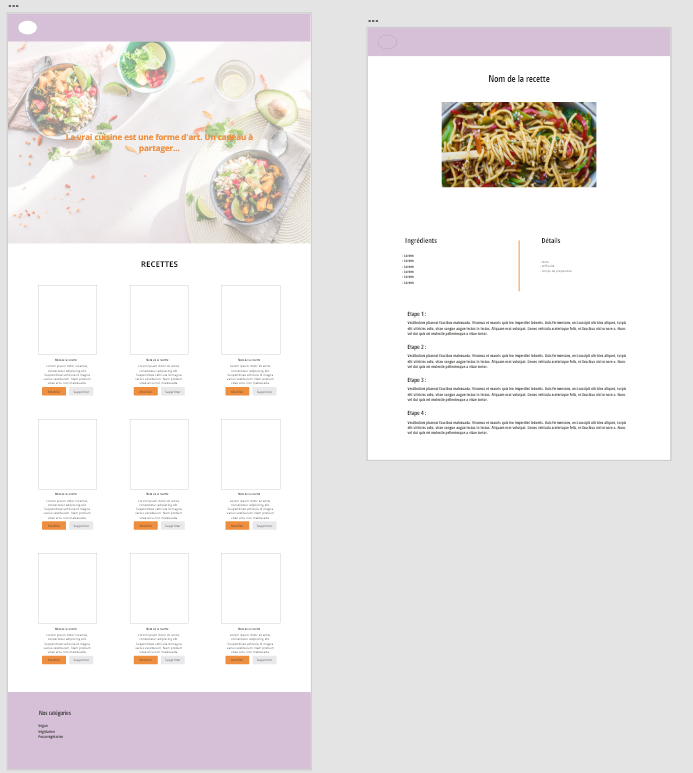

- [Project :](#project-)
  - [Project Stack :](#project-stack-)
  - [Deployment :](#deployment-)
  - [Installation :](#installation-)
- [Veggie & Cook :](#veggie--cook-)
- [Functional analysis](#functional-analysis)
  - [Entitys](#entitys)
  - [Database](#database)
  - [Users :](#users-)
  - [Webdesign](#webdesign)
- [WebApp developpement](#webapp-developpement)
  - [Packages](#packages)
    - [Vich Uploader](#vich-uploader)
- [Security](#security)
- [Difficulties](#difficulties)
- [More works to do :](#more-works-to-do-)
  - [](#)

# Project :

A project to work and improve Symfony skills during my apprenticeship at Digital Campus.

## Project Stack :

- Symfony 5.0, Twig, Bootstrap, CSS
- PostGreSQL

## Deployment :

With Heroku : http://veggieandcook.herokuapp.com/

## Installation :

```bash
  composer install
  symfony serve
```

# Veggie & Cook :

A collaborative cooking website for vegan, vegetarian and pescatarian people who like to share their recipes.

The web app enable the possibility to see and share recipes. 

To share, the only requierement is to register. 


# Functional analysis

An application with :
- a login system
- a private space for users in which they can find recipes they shared and where they can :
  - create a new recipe
  - edit a recipe they have shared
  - see details of a recipe
  - delete a recipe
  
- Peut donner lieu à un Use Case UML.  
  

## Entitys
    1. Recipe
    2. Category
    3. User

## Database
- An UML based on the functional analysis
- A MySQLWB diagram.  
  

## Users :
- Registered user
- Visitors
  
## Webdesign 

- A sneak peek of the webdesign 
  
  
# WebApp developpement

## Packages
#
### Vich Uploader
  - To enable image upload, especially during the creation of a recipe.
  - Files automatically upload on the upload file that I configured. 

#

# Security

- Crypted passwords
- Users are granted permission to edit and delete only on their shared recipes.


# Difficulties

- Authentification system. I wanted to add a confirmation e-mail system.


# More works to do :
## 
  - Confirmation email system to enable more security.
  - Moderation system to verify the conformity of each recipes.
  - Possibility to edit passwords.