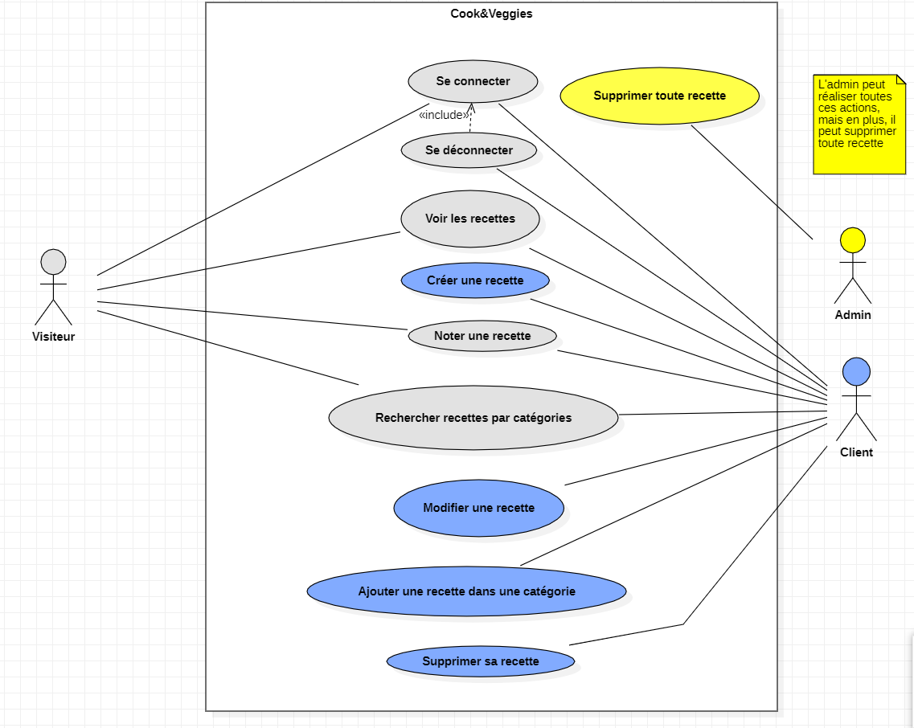
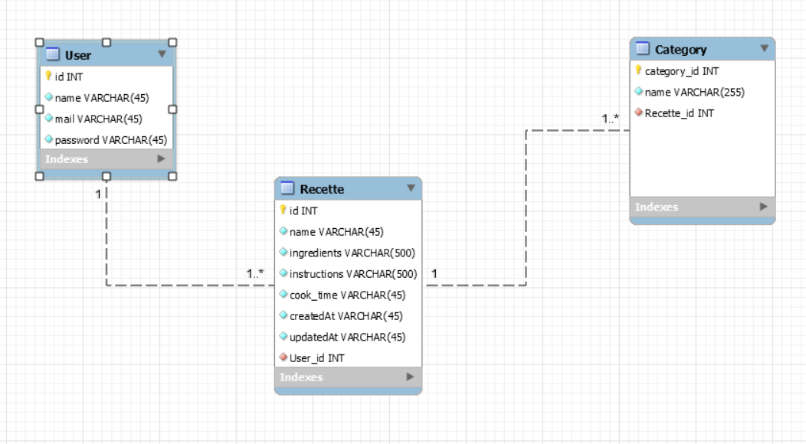

- [Analyse générale du projet](#analyse-générale-du-projet)
  - [Analyse fonctionnelle](#analyse-fonctionnelle)
  - [Couche métier](#couche-métier)
  - [Modélisation base de données](#modélisation-base-de-données)
- [Configuration de l'application](#configuration-de-lapplication)

# Analyse générale du projet
Un site collaboratif de recettes vegan, végétarienne, pescovégétarien.


L'application permet à ce stade de voir et partager des recettes si on le souhaite.

## Analyse fonctionnelle

Une application avec :
- un système de login avec deux types d'utilisateurs (USER, ADMIN)
- un espace privé qui affiche les recettes et propose des actions pour :
  - créer une recette
  - modifier une recette
  - voir les détails d'une recette
  - supprimer une recette
  - 
- Compréhensible voire dicté pour le client.
- Peut donner lieu à un Use Case UML.  
  

## Couche métier
- dégager les types de données
- Ici : 
    1. Recette
    2. Catégories 
    3. Menus
    4. Picture
    5. User

## Modélisation base de données
- Un diagrammme de classe UML basé sur l'analyse fonctionnelle.
- Nous ici, on va créer un diagramme MySQLWB.  
  


# Configuration de l'application 
1. database 
   
   ```bash
   symfony console doctrine:database:create
   # faire la connexion avec la base de données
    DATABASE_URL="mysql://root:@127.0.0.1:3306/db_projet_symfony"
   ```
2. les entités Recette et Catégories et leur relation
   ```bash
   symfony console make:entity Recipe #(propriétés name, ingredients, instructions, cook_time, createdAt, accroche)
   symfony console make:entity Category #(name)
   symfony console make:entity Menu #(name)
   symfony console make:entity Picture #(name, VichBundle)
   symfony console make:entity User #(username, email, password)

   ```
3. Migrations et Fixtures
4. MakeCrud
5. Vich
6. Liip bundle thumbnails
7. Authentification system
8. Mail de confirmation mail